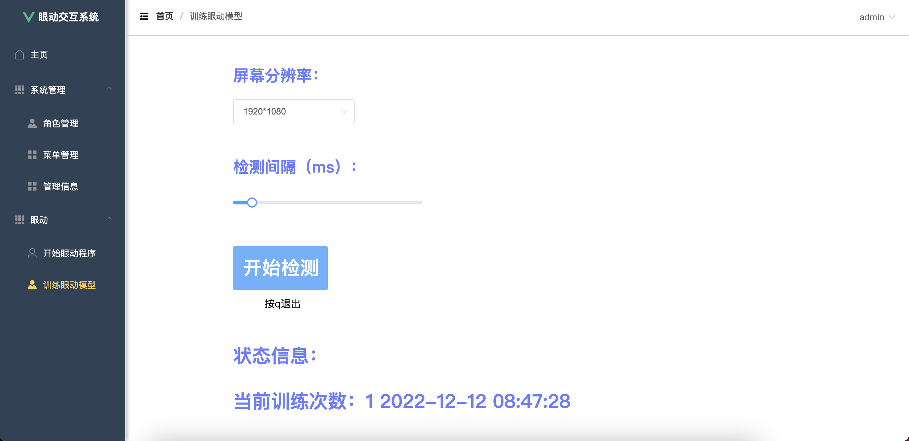
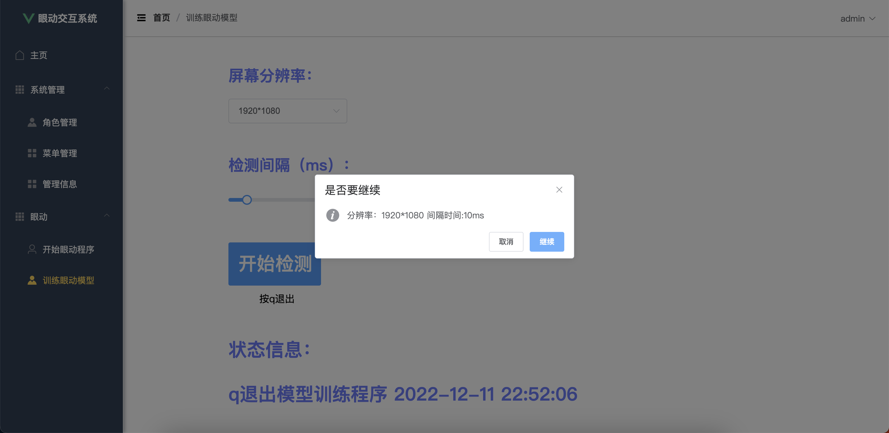
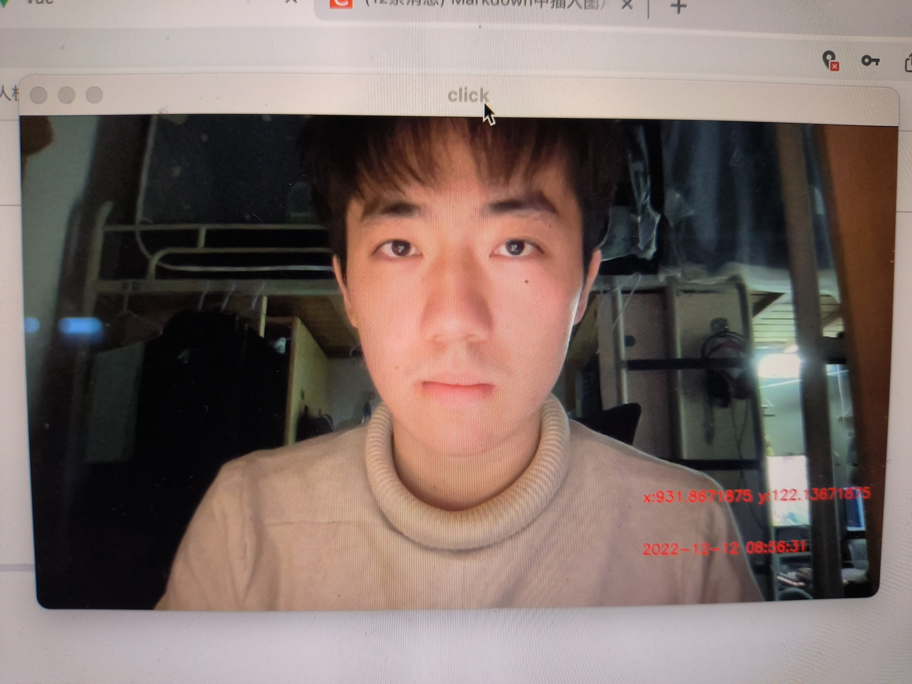
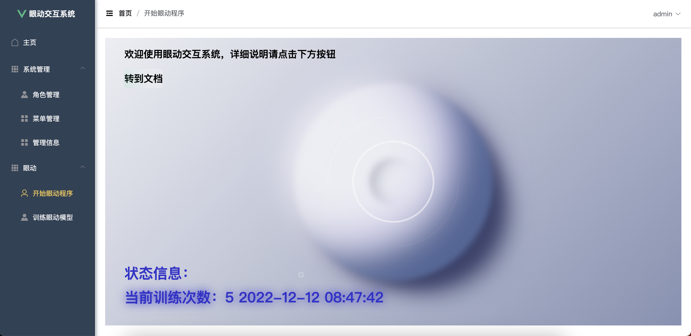
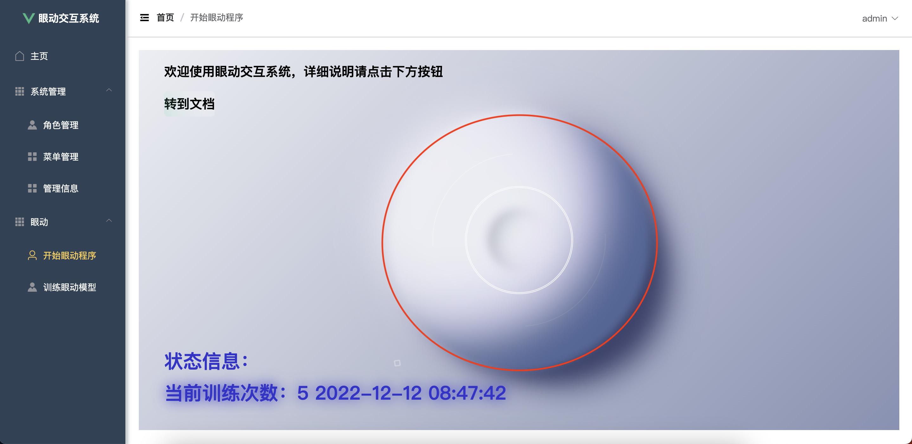
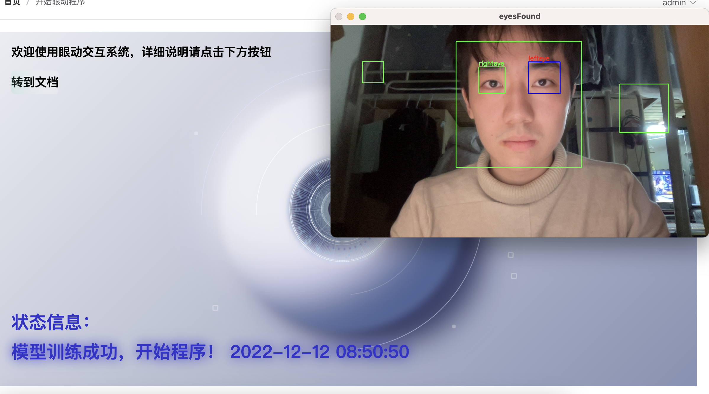

# 眼动交互系统使用文档

😎欢迎使用眼动交互系统，首先你需要训练眼动模型，不然系统无法使用眼动功能。

## 1.训练眼动模型

**1.1 点击左侧菜单栏眼动->训练眼动模型，可以看到训练眼动模型界面**

**1.2 选择你的屏幕分辨率，眼动程序的检测间隔，而后点击“开始检测”，会有确认弹窗**

**1.3 弹窗中确认分辨率和间隔时间是否正确，若正确，点击继续，若程序正常运行，在状态信息依次会显示**

> 1. 正在启动训练程序...
> 2. 正在启动摄像头...
> 3. 启动成功，请开始点击！

到这里，训练程序已经启动成功

**1.4 开始点击**

- 在点击的时候，会有一个显示实时信息的弹窗，在点击完成后会展示点击时的图片和光标的位置信息以及时间

  

- 一次点击若成功，在状态信息中点击次数会增加
- 可以多次执行点击程序，不会清空之前的结果，但是不能更改参数
- 为了更精确的定位鼠标，点击量在100次左右最佳

- 点击结束后，按下键盘q可退出程序，同时，在训练程序运行后的任何时刻按下键盘q均可退出

⚠️注意，确定目光已经跟随光标后再点击。

到这里，训练程序已经完成，可以开始眼动程序之旅啦～😁

## 2.开始眼动程序

**2.1 点击左侧菜单栏眼动->开始眼动程序，可以看到如下界面**

**2.2 点击红色圆形区域，即可开始眼动程序**

**2.3 若程序正常运行，在状态信息依次会显示**

> 1.正在启动摄像头...
>
> 2.摄像头启动成功，开始训练模型！
>
> 3.模型训练成功，开始程序！

到这里，程序成功运行，其中，训练模型大约需要3～5分钟

**2.4 在程序运行后，会有视频弹窗立刻弹出，在弹窗中会显示图片以及人脸、左右眼的识别信息**

若程序运行时未检测到人脸以及眼睛信息，则会报出“未找到眼睛”的异常

**2.5 开始程序**

**键盘和功能对照**

| 按键 |         功能         |
| :--: | :------------------: |
| W/w  |     开启眨眼功能     |
| E/e  |     关闭眨眼功能     |
| A/a  | 开启光标随眼运动功能 |
| S/s  | 关闭光标随眼运动功能 |
| Q/q  |       退出程序       |

**眨眼功能**

|    眨眼    |   功能   |
| :--------: | :------: |
| 眨单次双眼 |   点击   |
| 眨两次双眼 |   双击   |
|   眨右眼   | 向下滑动 |
|   眨左眼   | 向上滑动 |

⚠️眨眼功能和光标随眼同时使用会降低精度

🎉🎉🎉

Designed by xmh & ckt